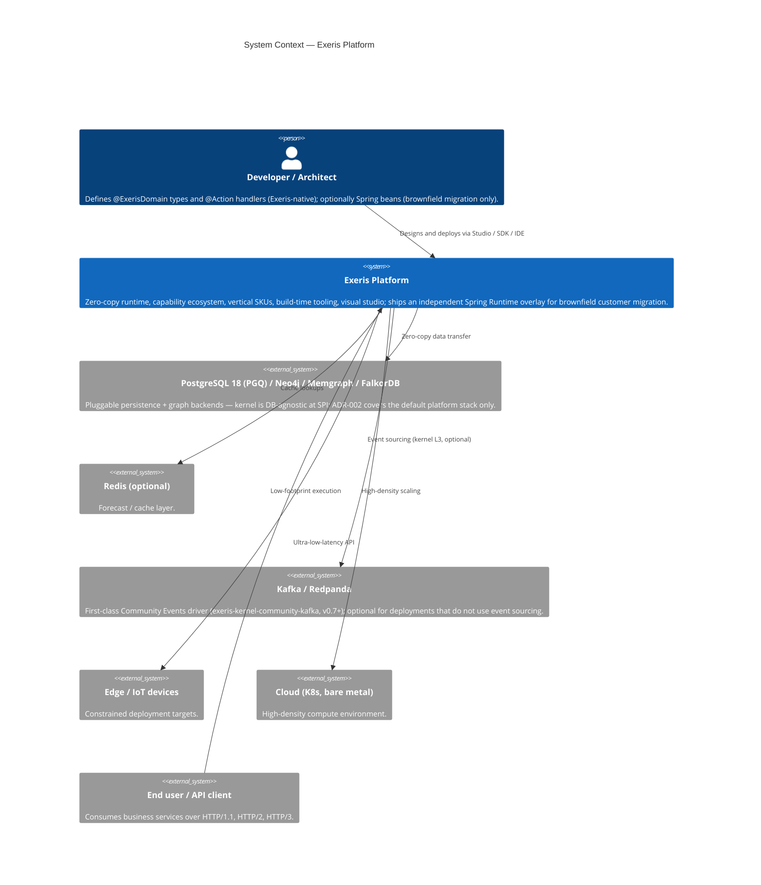
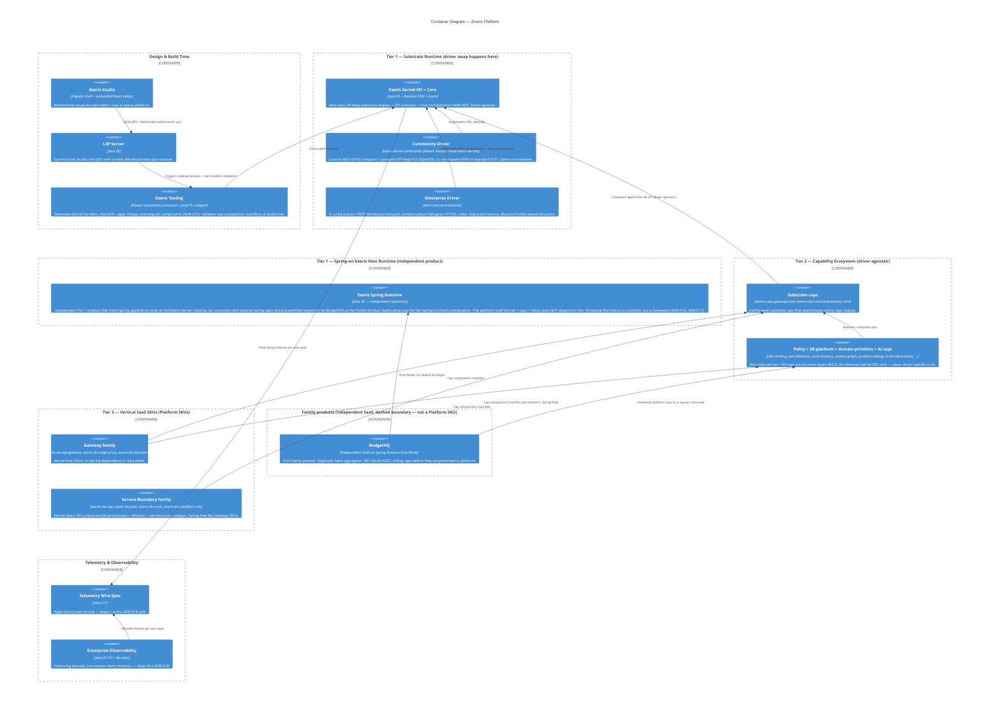

# Exeris Systems: High-Level Architecture (HLA)

## 1. Executive Summary

Exeris is a next-generation JVM runtime and development platform engineered for **Zero-Waste Compute**. It addresses the structural inefficiencies of mainstream Java stacks (the "Software Inflation Tax") through three coupled mechanisms:

1. A **zero-copy, off-heap execution kernel** that bypasses the JVM heap on hot paths via Project Panama (FFM API) and Project Loom (Virtual Threads + Structured Concurrency).
2. A **build-time, entity-first development lifecycle** that turns annotated POJOs into kernel-native handlers, sagas, OpenAPI, and Angular UI components.
3. A **Spring-on-Exeris host runtime** (`exeris-spring-runtime`) — an independent Tier 1 repository, sold as its own product, that lets *customers with existing Spring applications* adopt the Exeris kernel incrementally without rewriting business code. Spring keeps DI, beans, and config; Exeris owns ingress, lifecycle, and the off-heap data plane. The platform itself — kernel, capability ecosystem, and first-party Platform SKUs — runs kernel-direct and does **not** depend on `exeris-spring-runtime`. Exeris Systems Family products (BudgetHQ being the first, §9) deliberately run on Spring Runtime + Exeris Kernel as the **dogfooding case for that specific combination** — proving the Spring-on-Exeris product works in production under real customer load, the way a brownfield customer would adopt it. The Spring Runtime is thus both a customer-facing product and the structural proof that **Exeris is a runtime, not a framework**: it can host even Spring code underneath, and that is the strongest possible statement of runtime ownership.

The same kernel underpins Edge/IoT, container, and on-prem deployments. Telemetry is in-process JFR with a separate decoder/tooling track (ADR-018), so observability does not require sidecars.

**Document scope.** This HLA establishes the three-tier structure that organizes the rest of the platform's documentation. **Tier 1 — Substrate** covers the kernel, host-runtime integration, SDK, tooling, and observability repositories; it is specified here in detail (§2 C4 model, §3.1 substrate capabilities, §6 open-core split, §7 Spring adoption, §8 telemetry). **Tier 2 — Capability Ecosystem** covers the `exeris-caps-*` repositories and the composition model that binds them; it is specified in §3.2 and given its own §4 model section. **Tier 3 — Vertical SaaS SKUs** (Platform SKUs) are pre-composed cap manifests shipped as first-party products; they are summarized in §3.3 and §5, with full architectural detail reserved for the SKU-specific architecture documents that ship per SKU repository. **Family products** (independent SaaS products built by Exeris Systems on the platform — BudgetHQ being the first) are structurally distinct from Platform SKUs and covered in §9.

## 2. C4 Architecture Model

### 2.1 Level 1: System Context



ADR-002 specifies **PostgreSQL 18 as the platform-recommended default stack** for new applications — it is explicitly *not* a kernel mandate. The kernel itself remains database-agnostic at the runtime SPI layer (per ADR-002 §"Kernel relationship"). The Community graph driver supports **both** SQL:2023 PGQ on Postgres **and** Cypher on Neo4j / Memgraph / FalkorDB via a unified `MATCH` DSL; the same business code works on either backend because the codegen pipeline (ADR-015) transpiles intent into the active driver's dialect at build time. The Enterprise tier adds a native PG wire protocol driver (via the Enterprise persistence subsystem) and a planned FFM-native Bolt v5 driver for Neo4j (TRL-4 — not yet shipping). Kafka 3.x is a **first-class Community Events driver** (`exeris-kernel-community-kafka` since v0.7 Sprint 5b2), not just an adjunct — but it is optional, since the default Community Events driver uses the Postgres Outbox pattern + JVM-heap pub/sub. Redis is an optional cache adjunct only.

### 2.2 Level 2: Containers

The Container view is organized in three structural stripes that mirror the three-tier architecture: **Substrate** (Tier 1) runs the kernel and host-runtime layer; **Capability Ecosystem** (Tier 2) holds the `@Provides`/`@Requires` modules that compose into products; **Vertical SaaS SKUs** (Tier 3) holds first-party Platform SKUs plus, separately marked, the Family product line. Design-time and observability spans cut across all three.



> **¹ Footnote on telemetry-spec Java version.** `exeris-telemetry-spec` deliberately targets Java 21 (not Java 26) to maximise third-party decoder portability per ADR-018. All other repositories in this diagram target Java 26 with `--enable-preview`.

Studio here is the platform-internal Studio (`exeris-platform/exeris-studio-frontend`); it is distinct from the top-level `studio/` workspace, which holds Angular 21 vertical demo apps. The codegen TS pipeline emits Angular components consumable by either surface. The Family product boundary is rendered with a dashed semantic in this description because BudgetHQ is structurally not a Platform SKU — it is an independent SaaS product that happens to consume platform capabilities through the same `@Provides` / `@Requires` mechanism a paying platform subscriber would.

### 2.3 Level 3: Components — Kernel internals

The kernel enforces physical separation across two orthogonal axes: **trust tier** (SPI / Core / Drivers) and **subsystem layer** (L0–L4). The Wall (ADR-006) keeps Spring out of SPI and Core entirely.

```mermaid
C4Component
    title Component Diagram — Exeris Kernel

    Component(spi, "SPI (The Constitution)", "Records + Interfaces", "Immutable contracts, implementation-blind, Spring-free (ADR-006).")
    Component(core, "Core (The Brain)", "Java 26 / ScopedValue / StructuredTaskScope", "Bootstrap DAG, orchestration, KernelProviders.")

    Container_Boundary(subsystems, "Subsystem Layers — L0 mandatory, L1–L2 standard, L3–L4 optional") {
        Component(l0, "L0 — Foundation", "Memory (LoanedBuffer, Arenas), JFR Telemetry", "Mandatory. Config is resolved by KernelBootstrap via ServiceLoader before the orchestrator runs and is not a Subsystem; Exceptions is not a Subsystem layer.")
        Component(l1, "L1 — Data & Integrity", "Security (ScopedValue, RLS), Persistence, Crypto/TLS (OffHeapTlsEngine)", "Standard.")
        Component(l2, "L2 — Data Synthesis", "Transport (I/O, scheduler), Graph (PGQ DSL), HTTP Codec (ADR-009)", "Standard.")
        Component(l3, "L3 — Logic Engines", "Events (sourcing, outbox)", "Optional.")
        Component(l4, "L4 — Orchestration", "Flow (Sagas, off-heap state per ADR-013)", "Optional.")
    }

    Container_Boundary(drivers, "Execution Drivers") {
        Component(community, "Community Driver", "NIO.2 / TCP / JDBC / Portable Off-Heap TLS (OpenSSL 3.x via Panama FFM)", "Standard high-performance Java implementation. Ships OffHeapTlsEngine from Core.")
        Component(enterprise, "Enterprise Driver", "io_uring / QUIC / EnterpriseQuicTlsEngine (ADR-019)", "Native-bypass, NUMA-aware via libnuma mbind() (see exeris-kernel-enterprise/docs/subsystems/memory.md), high-density.")
    }

    Rel(core, spi, "Implements")
    Rel(core, subsystems, "Orchestrates")
    Rel(community, spi, "Implements")
    Rel(enterprise, spi, "Implements")
    Rel(community, subsystems, "Provides for")
    Rel(enterprise, subsystems, "Provides for")
```

> **Telemetry layer placement note.** This diagram follows `exeris-kernel/docs/architecture.md` and places Telemetry under L0 Foundation. The kernel-side subsystem document `exeris-kernel/docs/subsystems/telemetry.md` currently classifies Telemetry as L1 Observability — that documentation drift is tracked for a kernel-docs pass and is not introduced by this HLA. The functional behaviour is identical either way: Telemetry attaches after Memory init completes, providing the Glass-Box visibility for all higher subsystems.

**Bootstrap DAG** (Core, canonical sequence — source-of-truth: `exeris-kernel/docs/subsystems/bootstrap.md`):

```
FOUNDATION (sequential, no JFR available yet):
    Memory

SERVICES (parallel via StructuredTaskScope, after FOUNDATION READY):
    Crypto & Persistence & Graph & Transport

RUNTIME (parallel, after SERVICES READY):
    Events & Flow & HTTP

→ KERNEL READY
```

`Config` is resolved by `KernelBootstrap` via `ServiceLoader<ConfigProvider>` *before* the orchestrator runs and is not a Subsystem in the DAG. `Exceptions` is not a Subsystem layer either. `Security` is an L1 Citadel concept, not a boot-DAG node — its semantics are governed by ADR-012 (fail-closed resource-server validation), distinct from the general bootstrap fail-fast/degrade policy. Bootstrap fail-fast (the policy that halts the process on missing OpenSSL ABI symbols, invalid memory partitions, or insufficient native access before the first byte of traffic) is specified in `exeris-kernel/docs/subsystems/bootstrap.md` §"Failure Sovereignty" — `FAIL_FAST` is the mandatory Strict Mode for production; `DEGRADE` is reserved for local dev.

## 3. Platform Capabilities Map

Capabilities are organized by tier rather than by capability type, mirroring the §2.2 Container structure.

### 3.1 Substrate Capabilities (Tier 1 — kernel and host-runtime properties)

These are not user-space capabilities — they are properties of the substrate itself, surfaced as `@Provides` contracts to higher tiers but not implemented in the cap layer.

| Capability | Technical realization | Decision | Business value |
|---|---|---|---|
| Zero-copy hot path | Panama FFM + LoanedBuffer ownership | ADR-007 | Eliminates ~60% CPU waste on GC/allocation |
| High-density compute | Virtual Threads + JEP 491 (no pinning) | ADR-007 | Far more concurrent flows per node on the same hardware |
| Edge sovereignty | ~128–200 MB target RSS baseline (AWS Graviton2 ARM64; methodology in `exeris-benchmarks/docs/edge-rss-baseline.md` — *planned, ships in `exeris-benchmarks` v0.8.0+*) | kernel WP §4 | Full Java on 512 MB IoT gateways |
| Bidirectional dev | Studio ↔ LSP ↔ source ↔ codegen | ADR-003, ADR-015 | Visual speed without low-code lock-in (clean Java) |
| Physical tenant isolation | Postgres RLS + ScopedValue context propagation | ADR-012 | Hard tenant isolation at the data plane |
| Compile-time RBAC | `@RequiresRole` codegen | ADR-014 | Authorization at the call site, not via runtime reflection |
| Distributed saga orchestration | L4 Flow Engine with off-heap state | ADR-013, ADR-022 | Self-healing distributed transactions; durable saga state via Persistence SPI Instant binders |
| Spring-hosting capability (`exeris-spring-runtime`, independent Tier 1 product) | Pure Mode + Compatibility Mode | ADR-010, ADR-011 | Brownfield customer migration path — host existing Spring apps on the kernel without rewriting. Not used by platform / SKUs. |
| Glass-box observability | JFR-first telemetry + crash-ring decoder | ADR-018 | Nanosecond-resolution traces, no sidecar |
| Stack-portable graph | Unified `MATCH` DSL → SQL:2023 PGQ (Postgres 18) **or** Cypher (Neo4j / Memgraph / FalkorDB); Enterprise: native PG wire driver + planned FFM Bolt v5 for Neo4j (TRL-4) | ADR-002 (platform-recommended default stack only — kernel is DB-agnostic at SPI) | Graph performance with backend choice; same business code on either dialect |
| Enterprise NUMA awareness | `libnuma mbind()` via Panama FFM | `exeris-kernel-enterprise/docs/subsystems/memory.md` §"NUMA-Aware Allocation" | Per-partition node-local memory binding on multi-socket hardware |

### 3.2 Composable Capabilities (Tier 2 — `exeris-caps-*` repositories)

User-space capabilities developed in `exeris-caps-*` repositories. Each is a named module with explicit `@Provides` and `@Requires` declarations. The capability composition model itself is specified in §4.

Capabilities are organized in seven layers. Each layer is independently reusable; an SKU manifest composes 10–15 caps drawn from across the stack. Domain primitives (layer 5) are deliberately decomposed below the SKU granularity so the same cap can back a CRM, an OMS, a PIM, or a customer-defined ERP composition without forking.

**License taxonomy.** ADR-020's two-valued open-core split (`public` / `enterprise-private`) covers the Tier 1 substrate cleanly. Tier 2 capabilities require a third value because the cap layer carries most of the platform's commercial value; without it the model contradicts the SKU-monetization thesis of §3.3 and §5.4. Capabilities therefore ship under one of three licenses:

| License tier | Terms | Coverage |
|---|---|---|
| `community` | Apache 2.0 / MIT | ~3 commodity caps that drive adoption and ecosystem integration. Code public, free for any use. |
| `commercial` | Exeris Commercial License (source-available; BSL-style) | The bulk of Tier 2 — substrate aggregates, Gateway building blocks, Gateway policies, all SB platform caps, all domain primitives, all AI Abstraction caps. Code visible in public repositories; production use requires an active Platform SKU subscription or Platform-tier license. |
| `enterprise-private` | Closed-source | One Tier 2 cap (`exeris-caps-bot-fingerprinting`, which depends on a kernel-tier SPI extension shipping in `exeris-kernel-enterprise`). Available to Enterprise-tier subscribers only. |

This extension is on the ADR roadmap — either as an amendment to ADR-020 broadening the visibility taxonomy, or as a dedicated **Capability Licensing Taxonomy ADR**. Until that lands, the column below labelled `License` is the working source-of-truth.

**Layer 1 — Substrate aggregates** (one per SKU family; provide the family's foundational lifecycle and bootstrap binding).

| Cap | `@Provides` | `@Requires` | License |
|---|---|---|---|
| `exeris-caps-gateway-core` | `GatewayLifecycle`, `IngressBootstrap` (aggregates layer 2 services) | kernel Transport / Crypto / HTTP SPIs | commercial |
| `exeris-caps-service-boundary-core` | `ApiSurfaceRegistry`, `ServiceLifecycleHooks`, `RequestContext` | kernel SPI | commercial |

**Layer 2 — Gateway building blocks** (decomposed out of `gateway-core` as separately composable caps; the aggregate above re-exports them under one manifest entry, but SKUs may pin individual caps to swap implementations).

| Cap | `@Provides` | `@Requires` | License |
|---|---|---|---|
| `exeris-caps-route-registry` | `RouteRegistry`, route-table reload SPI | `gateway-core` | commercial |
| `exeris-caps-upstream-pool` | `UpstreamPool`, connection lifecycle | `gateway-core` | commercial |
| `exeris-caps-policy-chain` | `PolicyChain` (ordered policy execution) | `gateway-core` | commercial |
| `exeris-caps-backend-health` | `BackendHealthMonitor` (active + passive probes) | `gateway-core`, `upstream-pool` | commercial |
| `exeris-caps-admin-control-plane` | `AdminControlPlane` (admin API for runtime config) | `gateway-core` | commercial |

**Layer 3 — Gateway policies** (each contributes to `PolicyChain`).

| Cap | `@Provides` | `@Requires` | License |
|---|---|---|---|
| `exeris-caps-rate-limiting` | `RateLimitPolicy` | `policy-chain` | commercial |
| `exeris-caps-jwt-validation` | `JwtAdmissionPolicy` | `policy-chain` | commercial |
| `exeris-caps-tls-termination` | `TlsTerminationPolicy` | `gateway-core`, kernel Crypto SPI | commercial |
| `exeris-caps-request-routing` | `RoutingPolicy` | `policy-chain`, `route-registry` | commercial |
| `exeris-caps-circuit-breaker` | `CircuitBreakerPolicy` | `policy-chain` | commercial |
| `exeris-caps-cors-policy` | `CorsPolicy` | `policy-chain` | **community** |
| `exeris-caps-waf-rules` | `WafPolicy` (rule engine for L7 filtering) | `policy-chain` | commercial |
| `exeris-caps-bot-fingerprinting` | `Ja3Ja4FingerprintExtractor`, `BotPolicy` | `tls-termination`, kernel Crypto proposal | enterprise-private |

**Layer 4 — Service Boundary platform caps** (reusable across every SB SKU; each is "you compose it once and it works regardless of domain").

| Cap | `@Provides` | `@Requires` | License |
|---|---|---|---|
| `exeris-caps-multi-tenancy` | `TenantContext` (ScopedValue-bound), RLS routing | `service-boundary-core`, kernel Security SPI | commercial |
| `exeris-caps-audit-trail` | `AuditLogSink`, structured event emission | `service-boundary-core` | commercial |
| `exeris-caps-rbac-policy` | `RbacPolicyEnforcer` (builds on ADR-014 codegen) | `service-boundary-core`, kernel Security SPI | commercial |
| `exeris-caps-soft-delete` | `SoftDeletePolicy`, retention scheduler | `service-boundary-core` | commercial |
| `exeris-caps-entity-versioning` | `EntityHistory`, change-set retrieval | `service-boundary-core` | commercial |
| `exeris-caps-i18n` | `LocaleResolver`, translation registry | `service-boundary-core` | **community** |
| `exeris-caps-attachment-storage` | `AttachmentStore` (S3/Azure/GCS adapter SPI) | `service-boundary-core` | commercial |
| `exeris-caps-search-index` | `SearchIndex` (full-text + faceted) | `service-boundary-core` | commercial |
| `exeris-caps-workflow-engine` | `Workflow` (state machines, approvals, timers) | `service-boundary-core`, kernel Flow SPI | commercial |
| `exeris-caps-notification-dispatch` | `NotificationDispatcher` (email/SMS/webhook fan-out) | `service-boundary-core` | commercial |
| `exeris-caps-import-export` | `BulkIngest`, `BulkExport` (CSV/JSON/XLSX) | `service-boundary-core` | commercial |
| `exeris-caps-rest-emission` | Codegen — auto-REST from `@ExerisDomain` | `service-boundary-core`, ADR-015 codegen | commercial |
| `exeris-caps-graphql-emission` | Codegen — auto-GraphQL schema | `service-boundary-core`, ADR-015 codegen | commercial |
| `exeris-caps-openapi-emission` | Codegen — OpenAPI 3.1 from domain model | `service-boundary-core`, ADR-015 codegen | commercial |

**Layer 5 — Domain primitive caps** (cross-SKU reuse; each represents one bounded domain concept that multiple SKUs share).

| Cap | `@Provides` | Notional `@Requires` | License |
|---|---|---|---|
| `exeris-caps-contact-graph` | `ContactGraph` (people, organizations, relationships) | `service-boundary-core`, graph SPI (ADR-002) | commercial |
| `exeris-caps-product-catalog` | `ProductCatalog` (SKU/variant/attribute model) | `service-boundary-core`, `entity-versioning` | commercial |
| `exeris-caps-pricing-engine` | `PriceList`, `DiscountPolicy`, `TaxRule` | `service-boundary-core`, `product-catalog` | commercial |
| `exeris-caps-inventory-tracking` | `StockLedger`, `Reservation`, `Movement` | `service-boundary-core`, `product-catalog` | commercial |
| `exeris-caps-order-lifecycle` | `OrderStateMachine`, `Fulfillment` | `service-boundary-core`, `workflow-engine`, kernel Flow SPI | commercial |
| `exeris-caps-payment-gateway` | `PaymentProvider` SPI (Stripe / Adyen / Przelewy24 adapters) | `service-boundary-core` | commercial |
| `exeris-caps-document-ingestion` | `DocumentIntakeQueue`, `IntakeAdmission` | `service-boundary-core`, `attachment-storage` | commercial |
| `exeris-caps-ocr-pipeline` | `OcrPipeline` (pluggable OCR backends) | `document-ingestion` | commercial |
| `exeris-caps-document-classifier` | `DocumentClassifier` (ML classification) | `document-ingestion`, `ai-llm-abstraction` (optional) | commercial |
| `exeris-caps-field-extraction` | `FieldExtractor` (structured data from docs) | `ocr-pipeline`, `ai-llm-abstraction` (optional) | commercial |
| `exeris-caps-form-recognition` | `FormTemplate`, `FormRecognizer` | `field-extraction` | commercial |
| `exeris-caps-content-types` | `ContentTypeRegistry`, schema-driven content model | `service-boundary-core` | commercial |
| `exeris-caps-content-versioning` | `ContentDraft`, `PublishSchedule`, `ContentLifecycle` | `content-types`, `entity-versioning` | commercial |
| `exeris-caps-asset-management` | `AssetLibrary` (media + binary management) | `attachment-storage`, `search-index` | commercial |
| `exeris-caps-bank-aggregator` | `BankAggregator` SPI (Tink / Salt Edge adapters) | `service-boundary-core` | commercial (BudgetHQ → promotable) |

**Layer 6 — AI Abstraction Layer caps** (cross-cutting; consumed by any SKU that needs ML capability without hard-coding a vendor).

| Cap | `@Provides` | `@Requires` | License |
|---|---|---|---|
| `exeris-caps-ai-llm-abstraction` | `LlmProvider` SPI (OpenAI / Anthropic / Azure adapters) | kernel SPI | commercial |
| `exeris-caps-ai-vector-store` | `VectorStore` SPI (pgvector / Milvus / Qdrant adapters) | kernel Persistence SPI | commercial |
| `exeris-caps-ai-embedding-pipeline` | `EmbeddingPipeline` | `ai-llm-abstraction`, `ai-vector-store` | commercial |
| `exeris-caps-ai-rag-orchestration` | `RagOrchestrator` (retrieval + generation pattern) | `ai-llm-abstraction`, `ai-vector-store`, `ai-embedding-pipeline` | commercial |
| `exeris-caps-ai-prompt-templating` | `PromptTemplateRegistry`, version-pinned prompt management | — | commercial |

**Layer 7 — Cross-cutting.**

| Cap | `@Provides` | `@Requires` | License |
|---|---|---|---|
| `exeris-caps-observability-bridge` | `JfrEventSink` (forwards JFR → ADR-018 wire) | kernel Telemetry SPI | **community** |

> **Note on transport implementations.** QUIC/HTTP/3, `io_uring`, IOCP (Windows) and other native-bypass transport mechanisms are **not Tier 2 capabilities**. They are alternative driver implementations of the kernel Transport / HTTP / Crypto SPIs and live in **Tier 1** — specifically in `exeris-kernel` (Community driver: custom NIO H1/H2 + portable Off-Heap TLS via OpenSSL/Panama FFM) or `exeris-kernel-enterprise` (Enterprise driver: `io_uring` / IOCP transport, `EnterpriseQuicTlsEngine` with H3). Tier 2 cap compositions are engine-agnostic — they declare requirements against the kernel SPIs and bind whichever driver implementation is on the classpath at deployment. The Enterprise "swap" is a Tier 1 JAR substitution, not a cap manifest change. See §4 for the architectural mechanism and §5 for per-SKU deployment implications.

> **Note on host-runtime independence.** No cap `@Requires` `exeris-spring-runtime`, and **no first-party Platform SKU layers it in either**. The platform — kernel, capability ecosystem, and all Tier 3 SKUs — runs kernel-direct: HTTP endpoints come from `@ExerisDomain` types + `@Action` methods + `rest-emission` codegen (ADR-015), not from Spring `@RestController` paths. `exeris-spring-runtime` is an independent Tier 1 product that ships separately for two consumers only: (a) customer applications doing brownfield Spring migration, and (b) Family products (BudgetHQ, §9) that deliberately dogfood the Spring-on-Exeris combination. The Wall (§4 below) extends to capabilities: caps cannot reach into Spring internals — which keeps the cap layer reusable across both kernel-direct deployments and Spring-Runtime-hosted deployments without manifest changes. Spring `@RestController` paths (in customer code or BudgetHQ, never in caps or SKUs) consume cap `@Provides` services through `exeris-spring-runtime`'s integration layer; the dependency arrow never reverses.

All cap repositories are currently in **specified** status — implementation cadence is driven by the SKU roadmap in §5 and the platform whitepaper §7. The Capability Composition Model and the License Taxonomy extension are both governed by forthcoming ADRs; until those land, the binding source-of-truth is the codegen pipeline (ADR-015), the kernel bootstrap lifecycle contract, and ADR-020 (interpreted as covering Tier 1 only).

**Compositional reuse is structural, not aspirational.** `exeris-caps-contact-graph` is one cap consumed by Context-Centric CRM, OMS (customer/recipient model), PIM (B2B trading-partner model), and BudgetHQ (account-owner model). `exeris-caps-ocr-pipeline` is consumed by IDP and by BudgetHQ's receipt-scan capability — the same cap, not a fork. This is what makes Tier 2 a genuine ecosystem: a customer at the Platform tier can pull `contact-graph` + `product-catalog` + `pricing-engine` + `inventory-tracking` + `order-lifecycle` + `payment-gateway` + a forthcoming `financial-ledger` cap + the SB platform layer and assemble a bespoke ERP composition that no Exeris-shipped SKU enumerates.

### 3.3 SKU Compositions (Tier 3 — named compositions sold as products)

A Platform SKU is a named, signed, **commercial-licensed composition** of §3.2 capabilities. The composition manifest is the source-of-truth artifact that Studio consumes for visualization and that the build-time pipeline (ADR-015) validates against the Wall (ADR-006) and `@Requires` graph. SKU compositions are version-pinned per release; the per-SKU manifest lives in the corresponding `exeris-sku-*` repository.

The manifests below show the full cap list per SKU. Where a cap is `community`-licensed it inherits its open license; the SKU composition itself is `commercial` regardless. `enterprise-private` caps inside an SKU require the corresponding Enterprise subscription tier on top of the SKU.

**Source-visibility policy (per ADR-023 §"SKU Repository Source-Visibility Policy").** Platform SKU repositories default to source-available public repositories under the Exeris Commercial License — the same source-available shape that governs `commercial`-licensed caps. Source-availability operationalises the Glass Box thesis at every audit layer, strengthens the Code Detachment Fee (§5.4 whitepaper) by including the SKU source in detachment scope, and aligns with potential CNCF / EU public-sector positioning. The single principled exception is the **Bot Blocker SKU**, which is closed-source on anti-abuse-security grounds — published detection logic helps adversaries circumvent the protection.

| Platform SKU | Family | Source visibility | Cap composition (full manifest, sorted by layer) |
|---|---|---|---|
| **API Gateway** | Gateway | Source-available (public repo) | `gateway-core`, `route-registry`, `upstream-pool`, `policy-chain`, `backend-health`, `admin-control-plane`, `rate-limiting`, `jwt-validation`, `tls-termination`, `request-routing`, `circuit-breaker`, `cors-policy`, `observability-bridge` |
| **Edge Proxy** | Gateway | Source-available (public repo) | `gateway-core`, `route-registry`, `request-routing`, `tls-termination`, `circuit-breaker`, `backend-health`, `observability-bridge`, edge-failover cap (SKU-specific) |
| **Bot Blocker** | Gateway | **Closed-source** (private repo) — anti-abuse security exception | `gateway-core`, `tls-termination`, `policy-chain`, `bot-fingerprinting` (enterprise-private), `waf-rules`, `rate-limiting`, `observability-bridge` |
| **IDP** | Service Boundary | Source-available (public repo) | `service-boundary-core`, `multi-tenancy`, `audit-trail`, `rbac-policy`, `attachment-storage`, `rest-emission`, `openapi-emission`, `workflow-engine`, `document-ingestion`, `ocr-pipeline`, `document-classifier`, `field-extraction`, `form-recognition`, `ai-llm-abstraction`, `ai-prompt-templating`, `observability-bridge` |
| **PIM** | Service Boundary | Source-available (public repo) | `service-boundary-core`, `multi-tenancy`, `audit-trail`, `rbac-policy`, `i18n`, `attachment-storage`, `asset-management`, `search-index`, `entity-versioning`, `content-versioning`, `product-catalog`, `import-export`, `rest-emission`, `graphql-emission`, `openapi-emission`, `observability-bridge` |
| **OMS** | Service Boundary | Source-available (public repo) | `service-boundary-core`, `multi-tenancy`, `audit-trail`, `rbac-policy`, `workflow-engine`, `notification-dispatch`, `circuit-breaker`, `product-catalog`, `pricing-engine`, `inventory-tracking`, `order-lifecycle`, `payment-gateway`, `contact-graph`, `rest-emission`, `openapi-emission`, `observability-bridge`. L4 Flow saga engine (ADR-013) consumed via kernel SPI. |
| **Headless CMS** | Service Boundary | Source-available (public repo) | `service-boundary-core`, `multi-tenancy`, `audit-trail`, `rbac-policy`, `i18n`, `attachment-storage`, `asset-management`, `search-index`, `content-types`, `content-versioning`, `rest-emission`, `graphql-emission`, `openapi-emission`, `observability-bridge` |

The **Context-Centric CRM data model** is `exeris-caps-contact-graph` from §3.2 layer 5. It is a single domain-primitive cap that Service Boundary SKUs may compose; it is not itself a standalone SKU until the 2029 product-form release planned in the whitepaper §7. When that SKU ships, its manifest will combine `contact-graph` with the SB platform layer and any CRM-specific caps that emerge.

**ERP-class compositions are customer-assembled.** No Exeris-shipped SKU is named "ERP". An ERP deployment is what a Platform-tier customer assembles in Studio by composing OMS + PIM + `contact-graph` (CRM primitive) + a forthcoming `financial-ledger` cap + the SB platform layer. Because every domain primitive is its own cap, the customer pays only for the caps they actually compose, the validation pipeline (ADR-015) checks the entire ERP manifest as a single graph, and the Wall enforcement (§4) guarantees that mixing domains does not break encapsulation. This is the structural meaning of "composable platform" at the buyer's perspective: vertical industry suites, customer-bespoke ERPs, and one-off internal tools are all expressions of the same Tier 2 surface, not separate product lines.

## 4. Capability Composition Model

The composition model is the Tier 2 contract that makes Tier 3 SKUs structurally trustworthy. This section is forward-referenced by a forthcoming ADR (Capability Composition Model); until that lands, the binding source-of-truth is the codegen pipeline (ADR-015), the Wall (ADR-006), and the kernel bootstrap lifecycle (`exeris-kernel/docs/subsystems/bootstrap.md`).

**Definitions.** A **capability** is a named module with three contract surfaces:

- `@Provides` services exposed to other capabilities (e.g. `RouteRegistry`, `RateLimitPolicy`, `JwtAdmissionPolicy`).
- `@Requires` declarations on capabilities it depends on. Declarations are version-pinned at build time.
- A **lifecycle** — `initialize` → `ready` → `drain` → `terminate` — tied to the kernel bootstrap subsystem state machine.

A **composition** is a directed acyclic graph of capabilities with no unresolved `@Requires` and no cycles. The kernel codegen pipeline (`exeris-tooling`, ADR-015) validates compositions at build time and refuses to start any composition with unresolved dependencies, cycles, version mismatches, or Wall violations. **Validation runs at build time, not at runtime** — a malformed cap composition fails the build, never the deployment.

**Worked example — API Gateway SKU composition.**

```
                    ┌─────────────────────────────────────┐
                    │   exeris-caps-gateway-core          │
                    │   @Provides: RouteRegistry,         │
                    │              UpstreamPool,          │
                    │              PolicyChain,           │
                    │              BackendHealthMonitor,  │
                    │              AdminControlPlane      │
                    │   @Requires: kernel SPI             │
                    └────────────────┬────────────────────┘
                                     │
       ┌───────────────┬─────────────┼─────────────┬─────────────────┐
       │               │             │             │                 │
       ▼               ▼             ▼             ▼                 ▼
  rate-limiting   jwt-validation  tls-term.   request-routing  observability-bridge
  @Requires:      @Requires:      @Requires:   @Requires:      @Requires:
   gateway-core    gateway-core    gateway-c.   gateway-core    kernel Telemetry SPI
                                   + kernel
                                   Crypto SPI
       │               │             │             │                 │
       └───────────────┴─────────────┴─────────────┴─────────────────┘
                                     │
                                     ▼
                             API Gateway SKU
                          (signed cap manifest,
                           validated at build time)
```

The validation pipeline at build time checks: (1) every `@Requires` edge resolves to a provider in the manifest; (2) no cycles exist; (3) all version constraints are mutually satisfiable; (4) no capability reaches across the Wall into Spring internals, sibling cap internals, or kernel private packages.

**Tier 1 substrate driver swap (the only swap that affects platform SKUs).** First-party Platform SKUs run kernel-direct — their API surface is `@ExerisDomain` + `@Action` + `rest-emission` codegen, never Spring. The only Tier 1 selection that varies across an SKU's deployments is the **kernel driver**: `exeris-kernel-community` Maven module (Community: NIO H1/H2 + portable Off-Heap TLS over TCP) or `exeris-kernel-enterprise` (Enterprise: `io_uring`/IOCP transport, `EnterpriseQuicTlsEngine`, HTTP/3, slab pools, NUMA). The cap manifest is byte-identical across both. `exeris-spring-runtime` is a separately purchased Tier 1 product (§7) for brownfield customer migration and BudgetHQ-style Family-product dogfooding — but it never sits underneath a first-party Platform SKU, and no cap ever `@Requires` it.

**Enterprise engine swap is a Tier 1 substrate change, not a Tier 2 cap manifest change.** Capabilities consume kernel Transport / HTTP / Crypto SPIs by interface; the actual implementation is bound at deployment time by whichever driver JAR is on the classpath:

- **`exeris-kernel` Community driver** ships H1/H2 over a custom NIO transport plus the portable Off-Heap TLS engine (OpenSSL 3.x via Panama FFM on standard TCP). This is the open-core baseline.
- **`exeris-kernel-enterprise` driver** ships `io_uring` (Linux) / IOCP (Windows) transport, `EnterpriseQuicTlsEngine` (QUIC TLS via OpenSSL `BIO_DGRAM` pair), HTTP/3 codec, slab-pool memory management, and `libnuma mbind()` NUMA-aware allocation.

Engine swap is therefore a Maven-coordinate change at the substrate layer (the Community driver ships as the `exeris-kernel-community` Maven module inside the `exeris-kernel` repository; the Enterprise driver ships as the `exeris-kernel-enterprise` artifact from the private enterprise repository — swap the dependency coordinate) or a runtime `ServiceLoader` selection between two drivers on the same classpath. **The cap composition manifest is byte-identical across Community and Enterprise deployments** because cap-layer code never references `io_uring`, QUIC, NIO, or any concrete driver — it references only the SPIs. This is what makes "Enterprise license unlocks engine swap" structurally clean: the same signed SKU manifest a Community subscriber received runs unchanged when an Enterprise license activates the alternative driver. There is no `exeris-caps-quic-*` or `exeris-caps-io-uring-*` cap — those would put driver-specific concerns into Tier 2, contradicting the engine-agnostic contract.

**The Wall extends to capabilities.** ADR-006 is the substrate-tier Wall. The cap-tier Wall has identical semantics: a capability cannot reach into Spring internals, into a sibling capability's private classes, or into the kernel's private packages. This is what makes a cap composition portable (same composition runs under Pure Mode and, where supported, Compatibility Mode), reusable across host runtimes, and detachable as IP (a composition can be lifted into a customer's repository fork without dragging hidden classpath dependencies). Wall violations at the cap layer fail the build via the same `exeris-tooling` pipeline that enforces them at the substrate.

**SKU = signed composition.** An SKU is a named composition with a signature from Exeris Systems, a version, and a set of licensing terms attached to specific caps (per the §3.2 license taxonomy: some caps are `community`-licensed, most are `commercial`-licensed, a few are `enterprise-private`). The composition manifest itself ships under the Exeris Commercial License. Customers who detach an SKU under the Code Detachment model (whitepaper §5.4) receive the unsigned composition manifest plus the build artifacts needed to operate it independently — including a perpetual-use grant for the underlying commercial-licensed caps for the detached version.

## 5. First-Party Platform SKUs

SKUs are organized into two families plus one cross-cutting data model. Each family has a consistent architectural shape; the table below summarizes the technical surface per SKU, with full architecture documents shipping per SKU repository.

| SKU | Family | Host-runtime mode | Enterprise driver benefits (Tier 1 swap) | Target deployment topology |
|---|---|---|---|---|
| API Gateway | Gateway | None (kernel-level data plane) | `io_uring` ingress, HTTP/3 + QUIC TLS, slab-pool memory — significant at sustained >50k RPS | Single-process or distributed; co-located with upstreams |
| Edge Proxy | Gateway | None (kernel-level) | `io_uring` + HTTP/3 highly recommended for edge deployments | Multi-region active-active; sub-ms failover |
| Bot Blocker | Gateway | None (kernel-level) | Enterprise driver exposes JA3/JA4 ClientHello fingerprint material from `CoreSslHandles` (kernel proposal — see below) | In-line with Gateway / Edge Proxy |
| IDP | Service Boundary | Kernel-direct (@ExerisDomain + rest-emission codegen) + kernel-level (AI Abstraction caps) | NUMA-aware allocation under heavy doc-processing load | Cloud or on-prem; air-gappable |
| PIM | Service Boundary | Kernel-direct (@ExerisDomain + rest-emission / graphql-emission codegen) | Marginal — Community driver typically sufficient | Cloud or on-prem |
| OMS | Service Boundary | Kernel-direct (@ExerisDomain + rest-emission codegen) + kernel-level (L4 Flow saga state) | Marginal — Community driver typically sufficient | Cloud; distributed saga state requires Postgres |
| Headless CMS | Service Boundary | Kernel-direct (@ExerisDomain + rest-emission / graphql-emission codegen) | Marginal — Community driver typically sufficient | Cloud or edge-co-located for read replicas |
| Context-Centric CRM data model | Cross-cutting cap | Composed by Service Boundary SKUs; not standalone | N/A (cap-layer, driver-agnostic) | N/A (cap-layer) |

> All SKU compositions are `commercial`-licensed regardless of the row above. The "Enterprise driver benefits" column refers exclusively to **Tier 1 substrate driver swap** (Community `exeris-kernel-community` Maven module → Enterprise `exeris-kernel-enterprise` artifact), not to a separate cap manifest or cap-layer license change.

**Gateway family architecture.** Kernel-level HTTP path with no Spring dependency in the data plane (consistent with the clarified ADR-021). The control plane (admin API, configuration reload) is single-process or distributed depending on cap manifest selection; observability flows through `exeris-caps-observability-bridge` to the ADR-018 wire format. The Enterprise driver swap (custom NIO H1/H2 → `io_uring` + HTTP/3 + QUIC TLS) lives in `exeris-kernel-enterprise` and is activated by Maven coordinate substitution at the substrate layer — Gateway SKU composition manifests are byte-identical across Community and Enterprise deployments. Bot Blocker additionally requires a JA3/JA4 TLS fingerprinting kernel proposal modifying `CoreSslHandles` to expose ClientHello fingerprint material before the request reaches the policy chain — that proposal is on the kernel roadmap; the corresponding `exeris-caps-bot-fingerprinting` cap is the only enterprise-private cap in Tier 2 because it depends on this kernel-tier extension.

**Service Boundary family architecture.** SB-family SKUs run **kernel-direct** — exactly like Gateway-family SKUs, with no Spring dependency anywhere in the data plane. The external API surface is generated at build time from `@ExerisDomain` types and `@Action` methods through `rest-emission` (and `graphql-emission` / `openapi-emission` where relevant) codegen capabilities (ADR-015); the emitted handlers register against `service-boundary-core`'s `ApiSurfaceRegistry` directly through kernel HTTP SPIs. There is no Spring `@RestController` in any first-party SKU. Heavy lifting (off-heap document processing for IDP, graph-attribute traversal for PIM, saga state for OMS, content-as-domain emission for Headless CMS) happens at the kernel level via composed caps. The Spring-on-Exeris brownfield migration path (§7) is a separate offering for *customers* who already have Spring code — it does not sit under any first-party SKU.

**Context-Centric CRM data model.** A cross-cutting cap consumed by Service Boundary SKUs. It encodes the anti-account-centric thesis: relationships, not accounts, are the primary key. The data model uses the kernel's stack-portable graph subsystem (unified `MATCH` DSL — transpiles to SQL:2023 PGQ on Postgres or Cypher on Neo4j/Memgraph/FalkorDB depending on the active driver, with Enterprise alternatives) for the underlying traversal; the cap layer adds the relationship-first vocabulary. Standalone product-form release is on the 2029 horizon per whitepaper §7.

**Spring Runtime relationship per consumer.** No first-party Platform SKU (Gateway or Service Boundary) uses Spring Runtime — all SKUs run kernel-direct. Gateway SKUs use a kernel-direct data plane (consistent with ADR-021 placing gateway-class workloads outside the `exeris-spring-runtime` scope); Service Boundary SKUs use a kernel-direct API surface emitted from `@ExerisDomain` + `@Action` by the codegen pipeline. **`exeris-spring-runtime` has two real consumers**, both outside the first-party SKU set: (i) customers with existing Spring applications doing brownfield migration (§7 — the only customer-facing Spring Runtime path); (ii) Family products like BudgetHQ (§9), which deliberately run on Spring Runtime + Exeris Kernel as the dogfooding case for that combination — proving in production that Spring Runtime works as a product. In neither consumer does Spring leak into the cap layer or into platform SKUs; caps stay Spring-free everywhere.

## 6. Open-core split

ADR-020's two-valued visibility taxonomy (`public` / `enterprise-private`) governs Tier 1 cleanly. Tier 2 introduces a third licensing value (`community` / `commercial` / `enterprise-private`) per §3.2, and Tier 3 SKUs are always `commercial`-licensed compositions. Family products (§6.4) sit outside the platform taxonomy entirely as proprietary independent SaaS.

### 6.1 Tier 1 — Substrate

| Surface | Open-core repositories | Enterprise-private repositories |
|---|---|---|
| Kernel | `exeris-kernel` (SPI / Core / Community / TCK) | `exeris-kernel-enterprise` |
| Host-runtime | `exeris-spring-runtime` | — |
| SDK / Tooling | `exeris-sdk`, `exeris-tooling` | — |
| Platform / Studio | `exeris-platform` (Studio core, LSP, studio backend) | `exeris-platform-enterprise` (planned — multi-env promotion, design-time RBAC, audit dashboards, multi-tenant org) |
| Benchmarks | `exeris-benchmarks` (Community, cross-runtime, no H3) | `exeris-benchmarks-enterprise` — H3 track per ADR-016 (*scope document planned; current README is a placeholder*) |
| Observability | `exeris-telemetry-spec` (wire format, open) | `exeris-enterprise-observability` (decoder, CLI, forensics) |

### 6.2 Tier 2 — Capability Ecosystem

Tier 2 introduces a third licensing value beyond ADR-020's `public` / `enterprise-private` split (see §3.2 "License taxonomy"). The full per-cap license assignment lives in the §3.2 tables; the summary below shows the distribution.

| License | Cap count | Examples |
|---|---|---|
| `community` (Apache 2.0 / MIT) | 3 | `exeris-caps-cors-policy`, `exeris-caps-i18n`, `exeris-caps-observability-bridge` |
| `commercial` (Exeris Commercial License, source-available) | 46 | Gateway substrate + building blocks + remaining Gateway policies, SB substrate + all platform caps (except `i18n`), all domain primitives, all AI Abstraction caps |
| `enterprise-private` (closed-source, Enterprise tier subscription only) | 1 | `exeris-caps-bot-fingerprinting` (depends on a kernel-tier SPI extension shipping in `exeris-kernel-enterprise`) |

Total: 50 caps across the seven layers in §3.2.

Native-bypass transport (QUIC/HTTP/3, `io_uring`, IOCP) is **not** a Tier 2 cap — it ships as part of the `exeris-kernel-enterprise` substrate driver (Tier 1), activated by Maven-coordinate swap. See §6.1 and §4 for the swap mechanism.

`commercial` caps are **source-available**: their code is in public-readable repositories so customers can audit them, fork them under their Code Detachment license (whitepaper §5.4), and observe the same engineering quality as the substrate. Production use requires an active Platform SKU subscription or a Platform-tier subscription that includes the cap. The model is structurally similar to GitLab CE/EE (source-available with commercial license), Elastic SSPL (post-2021), and the Confluent Community License.

### 6.3 Tier 3 — Platform SKUs

Every Platform SKU is a **commercial-licensed composition** of underlying caps. The composition manifest itself (the cap list, version pins, signature) ships under the Exeris Commercial License regardless of the licensing of individual underlying caps. SKU repositories are source-available public repositories by default per ADR-023 §"SKU Repository Source-Visibility Policy" — closing the audit gap at the SKU layer alongside the cap layer — with the Bot Blocker SKU as the single principled closed-source exception on anti-abuse-security grounds. A subscriber receives the right to run the named composition; a customer who pays the Code Detachment Fee (whitepaper §5.4) receives transferable ownership scoped to the SKU's source-visibility class.

| SKU repository | License | Source visibility | Note |
|---|---|---|---|
| `exeris-sku-api-gateway` | commercial | Source-available (public) | Composition includes commercial caps; Enterprise Tier 1 driver swap (`exeris-kernel-enterprise`) available — same manifest, different substrate driver |
| `exeris-sku-edge-proxy` | commercial | Source-available (public) | Same Tier 1 substrate driver swap pattern; Enterprise driver recommended for edge deployments |
| `exeris-sku-bot-blocker` | commercial | **Closed-source** (private) | JA3/JA4 fingerprinting cap is `enterprise-private`; the SKU repository is itself closed-source on anti-abuse-security principle per ADR-023 amendment. Detachment scope per whitepaper §5.4 differs: perpetual binary-use licence + manifest, not source. |
| `exeris-sku-idp` | commercial | Source-available (public) | Includes AI Abstraction caps (all commercial) |
| `exeris-sku-pim` | commercial | Source-available (public) | |
| `exeris-sku-oms` | commercial | Source-available (public) | Composes the L4 Flow saga engine via kernel SPI |
| `exeris-sku-headless-cms` | commercial | Source-available (public) | |

### 6.4 Family products (out of open-core taxonomy)

| Family product repositories | Visibility |
|---|---|
| `budgetHQ/` (and any `budgethq-*` sibling repos) | **proprietary** — not part of the open-core split; commercially independent of the platform IP |

> **Note on Family products in this table.** BudgetHQ repositories appear here only to clarify the boundary between platform IP and Family-product IP. BudgetHQ is not open source — it is a proprietary Family product run as an independent SaaS business. The platform's open-core promise extends to substrate, caps, and SKU compositions; it does not extend to Family products. This is structurally important: it demonstrates that the platform is genuinely usable by independent SaaS products whose source code remains private.

Visibility taxonomy is two-valued (`public` / `enterprise-private`) per ADR-020. Cross-repo ADRs use `.link.md` stubs in every affected repository.

## 7. Spring-on-Exeris — Brownfield Customer Migration via `exeris-spring-runtime`

`exeris-spring-runtime` is an **independent Tier 1 product**, sold separately from the kernel and from Platform SKUs. The platform itself, all Tier 2 caps, and all Tier 3 SKUs run kernel-direct and have no dependency on it. This section describes the *customer-facing* migration path it enables: a team that already has a Spring application and wants to adopt the Exeris kernel underneath, without rewriting their controllers, services, or domain code. It also doubles as the structural showcase that **Exeris is a runtime, not a framework** — strong enough to host Spring code on top of the same kernel that runs the platform's kernel-direct SKUs.

### 7.1 Pure Mode (default for the brownfield path, recommended)

Spring application stays as-is. Exeris owns ingress; Spring controllers execute on Exeris-owned request paths with ScopedValue context propagation; no servlet/reactive stack underneath; `ThreadLocal` banned on hot paths. ADR-010 + ADR-011.

### 7.2 Compatibility Mode (opt-in)

Opt-in via `exeris.runtime.web.mode=compatibility` for Spring code that genuinely needs ThreadLocal bridging (e.g. `SecurityContextHolder`). Isolated in `*.compat.*` sub-packages and never auto-active in Pure Mode. JDBC compatibility (ADR-017) is opt-in within Compatibility Mode and documents specific bypass semantics (`PersistenceAdmissionStageEvent` bypass, per-statement JFR events, `PersistenceErrorTranslator`).

### 7.3 Out of scope (ADR-021)

Gateway-class workloads — Spring Cloud Gateway (both flavours) and RouterFunction style — are explicitly out of scope for `exeris-spring-runtime`. The architectural home for those workloads is the Tier 3 Gateway-family Platform SKUs (§3.3, §5), which compose `exeris-caps-gateway-core` at the kernel level with no Spring dependency in the data plane. A brownfield customer with Spring Cloud Gateway today should plan to migrate that surface to a Gateway SKU rather than to `exeris-spring-runtime`.

### 7.4 BudgetHQ — production proof that Spring-on-Exeris works as a product

BudgetHQ (the first Family product, §9) is built as a Spring application running on `exeris-spring-runtime` + Exeris Kernel. This is the **dogfooding case for the Spring-on-Exeris combination itself**: Exeris Systems runs its own Family product on Spring Runtime exactly the way a brownfield customer would, generating production-load bug reports and performance data for `exeris-spring-runtime` as a product. It is not a substitute for paying customer deployments, and it is not "the platform running on Spring" — the platform runs kernel-direct. BudgetHQ-as-dogfooding is specifically about validating that the Spring-on-Exeris product is real, shippable, and operable under load by the team that builds it.

## 8. Telemetry & Observability Architecture (ADR-018)

The telemetry path is split across three repositories with strict directionality:

```
Repo A (exeris-kernel-enterprise, producer) ──► Repo C (exeris-telemetry-spec) ◄── Repo B (exeris-enterprise-observability, consumer)
```

- **Repo A** produces 64-byte binary frames into a crash-ring file or a live TCP stream.
- **Repo C** defines the wire format (`EXRSCRSH` for crash files, `EXRSLIVE` for live streams), frozen field offsets, append-only versioning (V1 active, V2 reserved). Open-licensed, Java 21 for maximum third-party decoder portability, publishable as a third-party decoder spec.
- **Repo B** consumes frames offline (crash forensics, ring-file inspection) and online (live attach, dropped-frame accounting). One-directional dependency graph: A → C ← B. B never depends on A.

This split lets the decoder tooling ship at a different cadence than the runtime, supports third-party decoders against the spec, and keeps the runtime free of decoder dependencies on its hot path.

**Capability-tier telemetry.** Capabilities emit JFR events via the `exeris-caps-observability-bridge` cap, which forwards them to Repo B consumers through the Repo C wire spec — identical to substrate-level telemetry. SKUs and Family products inherit this telemetry pipeline by composing the observability bridge cap; they do not need to define their own observability surface. This means an API Gateway SKU instance, a BudgetHQ production node, and a kernel running an unrelated business application all produce telemetry through the same wire format and can be consumed by the same Repo B tooling.

## 9. Exeris Systems Family Products

A **Family product** is built and operated by Exeris Systems itself, on the Exeris Platform, as a commercially independent SaaS business. It is structurally distinct from a Platform SKU on three axes: (a) it is not sold as a cap composition to platform subscribers — it is sold directly to end customers as its own product; (b) it has independent brand, pricing, customer base, and roadmap; (c) it consumes platform capabilities through the same `@Provides` / `@Requires` mechanism platform subscribers do, with no privileged shortcuts.

**Architectural rules every Family product follows.**

- Runs on the Exeris kernel. **BudgetHQ is the singular exception that also runs on `exeris-spring-runtime`** — deliberately, to dogfood the Spring-on-Exeris product. All future Family products are pure Exeris: built on `exeris-sdk` (`@ExerisDomain`, `@Action`, `@Field`, `@Relationship`, `@RequiresRole`) plus `exeris-tooling` codegen, with the platform's Tier 2 cap ecosystem providing reusable functionality. No future Family product will use `exeris-spring-runtime`.
- Consumes platform capabilities through the public Tier 2 composition surface — no internal or "preview-only" access.
- May prototype new capabilities under production load before they are promoted to the platform's capability ecosystem.
- Proprietary code, branding, and customer data are entirely outside the platform's IP perimeter (the boundary called out explicitly in §6.4).
- Inherits platform telemetry by composing `exeris-caps-observability-bridge`.

### 9.1 BudgetHQ — the HLA case study

BudgetHQ is the first Family product. It is an independent SaaS in the personal finance management category, positioned in Europe as "holistic net-worth tracking for the mass affluent segment." Architecturally:

- **Application stack.** Exeris Spring Runtime in Pure Mode for the entire stack. Spring `@RestController` paths on Exeris-owned ingress with ScopedValue context propagation. No Compatibility Mode shims in production.
- **Bank-aggregator capability.** Tink and Salt Edge SPI adapters, with the platform-level bank-aggregator SPI abstraction designed first inside BudgetHQ. The abstraction is on the promotion path to a reusable Service Boundary capability that any Service Boundary SKU (especially IDP and OMS) can compose.
- **Receipt-scan capability.** Bridges to the platform's IDP capability via the AI Abstraction Layer SPI (the same AI Abstraction Layer that ships as the IDP Platform SKU). Prototyped inside BudgetHQ; the AI Abstraction Layer SPI itself is on the cap roadmap.
- **Subscription-billing capability.** Stripe adapter, prototyped inside BudgetHQ. On the promotion path to a reusable platform cap (any Service Boundary SKU offering metered billing will consume the promoted cap).
- **OAuth/OIDC B2C identity capability.** Prototyped inside BudgetHQ for end-user authentication.
- **Telemetry.** BudgetHQ composes `exeris-caps-observability-bridge` and emits to a Repo B consumer running in BudgetHQ's own infrastructure — same wire format as a platform subscriber's telemetry, distinct consumer instance.

Each prototyped capability lands in the platform's capability ecosystem **after** BudgetHQ has stabilized it in production, never before. This inverts the "demo product" framing of earlier strategic documents: BudgetHQ is not built to validate the platform; the platform is structurally sound enough that BudgetHQ can run on it from day one, and that is the validation. The capability development pipeline replaces the "Trojan horse" lead-generation framing from earlier Corelio strategy materials.

### 9.2 Family product pattern extensibility

The Family product pattern is extensible — additional Family products may emerge in other B2C SaaS verticals over time. **All future Family products will be built pure-Exeris** on `exeris-sdk` + `exeris-tooling` (with the Tier 2 cap ecosystem providing reusable functionality), not on `exeris-spring-runtime`. BudgetHQ is the singular Spring-on-Exeris Family product because its dogfooding role is to validate the Spring Runtime as a product; once that role is filled, the pattern for new Family products is pure Exeris by default. The HLA deliberately does not commit to specific future Family products beyond BudgetHQ — premature commitment to a long Family-product roadmap weakens the platform's focus claim, and any future Family product earns its place by being a real commercial bet rather than a roadmap entry.

## 10. References

- **Decision registries.** Tech ADRs: [`adr-index.md`](adr-index.md). Business ADRs (`BUS-NNN`): [`business-adr-index.md`](business-adr-index.md). Templates and lifecycle: [`templates/README.md`](templates/README.md).
- **Kernel whitepaper.** [`exeris-kernel/docs/whitepaper.md`](../exeris-kernel/docs/whitepaper.md) — long-form substrate technical pillars, SLA/SLO baseline table, TCK-enforced performance contract.
- **B2B technical whitepaper.** [`b2b-technical-whitepaper.md`](b2b-technical-whitepaper.md) — buyer-facing summary of evidence, three-tier architecture, SKU inventory, and adoption paths.
- **Execution plan.** [`execution-plan-whitepaper-hla-restructure.md`](execution-plan-whitepaper-hla-restructure.md) — the restructure plan this HLA was authored against.
- **Source-of-truth subsystem docs.** Bootstrap DAG: [`exeris-kernel/docs/subsystems/bootstrap.md`](../exeris-kernel/docs/subsystems/bootstrap.md). Crypto + TLS engine placement: [`exeris-kernel/docs/subsystems/crypto.md`](../exeris-kernel/docs/subsystems/crypto.md) and [`exeris-kernel-enterprise/docs/subsystems/crypto.md`](../exeris-kernel-enterprise/docs/subsystems/crypto.md). NUMA: [`exeris-kernel-enterprise/docs/subsystems/memory.md`](../exeris-kernel-enterprise/docs/subsystems/memory.md) §"NUMA-Aware Allocation".
- **Architecture guardrails per repo.** Each repository carries a `CLAUDE.md` with enforced rules (SPI blindness, Wall integrity, mode isolation, hot-path bans, comparator fairness for benchmarks).
